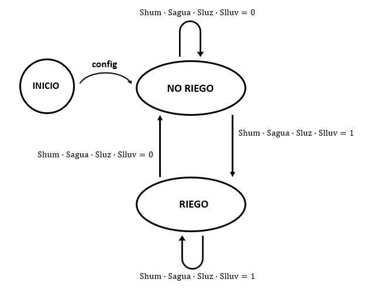

# Control de riego en una plantación
#### Trabajo Práctico con Máquinas de Estado
### Memoria descriptiva

Mi sistema será el encargado de controlar el riego de una plantación. Para decidir en que momentos regar se basa en los siguientes principios:
1. Solo se riega por la noche, o por la madrugada. De esta forma se ahorra agua, ya que durante el día ésta se puede evaporar por la temperatura de los suelos.
2. Si llueve se detiene el riego.
3. Si no hay agua en la cisterna no se puede regar. Si la bomba se encendiera aún si haber agua, se dañaría, generando un costo alto repararla o cambiarla.
4. La húmedad de la tierra será el parámetro clave para saber si regar o no.

El sistema solo cuenta con dos estados en su funcionamiento **(regar / no regar)** pero como mencionamos antes, depende de varias variables. Para simplificar el sistema, tomaremos los valores sensados como **0 y 1**. Dependerá de la calibración y sensibilidad deseada por el usuario para cada sensor.

- Sensor de nivel de agua en la cisterna: 0 si no hay agua / 1 si hay agua.
- Sensor de luz solar: 0 si es de día / 1 si es de noche.
- Sensor de lluvia: 0 si llueve / 1 si no llueve.
- Sensor de húmedad de la tierra: 0 si está húmeda / 1 si está seca.

*Notar que los sensores valen 0 cuando deben inhabilitar el riego.*

| Sagua  | Sluz  | Slluvia  | Shum  |   |
| ------------ | ------------ | ------------ | ------------ | ------------ |
| 0  | X  | X  | X  | NO RIEGO  |
| X  | 0  | X  | X  | NO RIEGO  |
| X  | X  | 0  | X  | NO RIEGO  |
| X  | X  | X  | 0  | NO RIEGO  |
| 1  | 1  | 1  | 1  | RIEGO  |

## Máquina de estado
blob/master/FMS.JPG?raw=true "maquinadeestado")